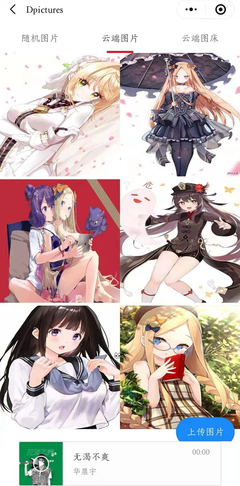

# D-PICTURE图片管家


[](https://github.com/RichardLitt/standard-readme)

## Table of Contents

- [Introduction](#Introduction)
- [Install](#install)
- [Usage](#usage)
- [API](#api)
- [Related_repo](#Related_repo)
- [Demo](#Demo)

## Introduction

本项目是由微信小程序进行开发，后端采用树莓派服务以及vercel云服务

项目路径介绍

- pages/index/      项目入口
- pages/audio/     云音乐推荐服务
- pages/main/      项目主界面入口
- pages/pictbed/  图床界面
- pages/random/ 随机图片界面
- pages/upload/   上传树莓派服务器模块

## Install

本项目需要 微信开发者工具 IDE ，在项目根目录下执行

```shell
npm install
```

## Usage

本项目使用微信开发者工具进行仿真模拟，建议在debug模式下运行，这样可以展现全部功能

## API

### 图床API

本项目采用https://vercel.com 提供的云服务，具体API如下：

项目基地址 https://file-up.vercel.app

#### GET /list 

返回图片列表，返回一个list

example return

```javascript
{"code": 200, "filelist": ["-336b16b38c468f1f.jpg", "177bb999267d9a88.jpg", "-1c76b09a93d5f2c3.jpg", "03.jpg", "01.jpg", "-1f6ca453ab94199a.jpg"]}
```

#### GET /uploads/\<filename>

filename 为上一个请求中的图片名称

返回一张图片

本请求可以作为一个图片url插入html的src链接中

示例：

https://file-up.vercel.app/uploads/-336b16b38c468f1f.jpg

### 网易云音乐随机图片API

https://cloud-music-api.vercel.app/

## Related_repo

本项目需要python后端项目进行配合，项目地址：

https://github.com/awsl1784597340/file_up 

## Demo

本项目提供bilibilil项目的视频链接演示，也可以在提交路径下展示。

https://www.bilibili.com/video/BV16i4y1P7Zj

项目截图演示

 